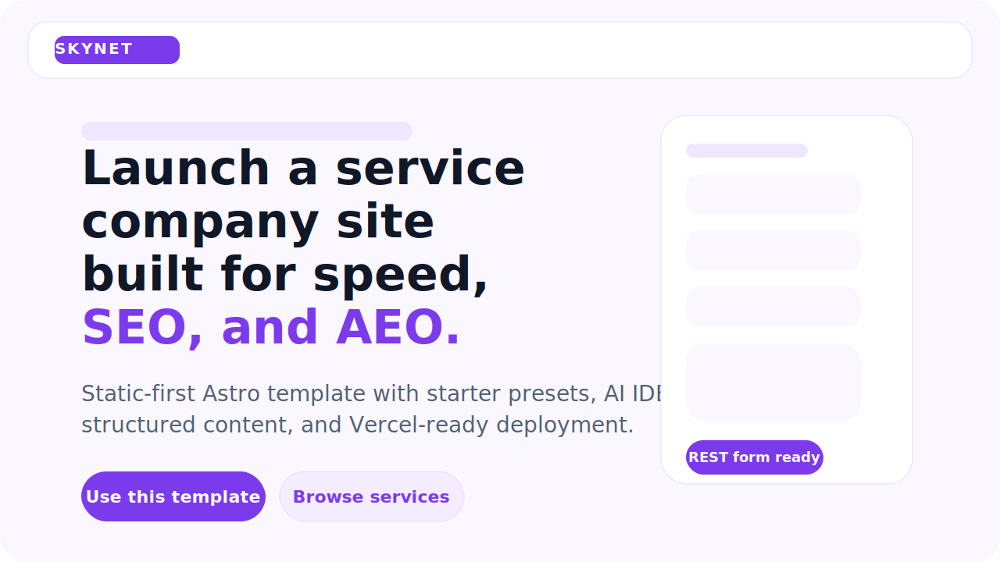
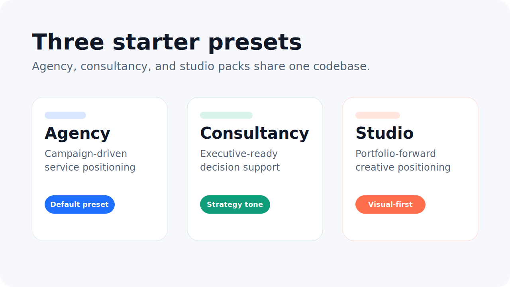

# Services Company Template

A Vercel-first Astro starter for agencies, consultancies, studios, and other service businesses that want a polished marketing site with strong performance, SEO, and AEO defaults.





## Best for

- agencies that want a fast, content-driven site they can rebrand quickly
- consultancies with complex offers that need clearer service and proof pages
- studios that want a stronger editorial and case-study foundation without adding a CMS first

## What you get

- Home, Services, Work, Insights, Process, About, Contact, FAQ, Privacy, and Terms pages
- 3 starter presets: `agency`, `consultancy`, and `studio`
- centralized brand, SEO, crawl, nav, CTA, social, and form config in `src/data/site.json`
- theme tokens in `src/config/theme.json`
- collection-driven content in `src/content/*`
- config-driven `robots.txt`, `llms.txt`, structured data, and sitemap
- AI-editor instruction files for Codex, Claude, Gemini, and Copilot

## Quickstart

```bash
npm install
npm run preset:apply -- agency
npm run dev
```

Then open `http://localhost:4321`.

## Change These First

Most teams can rebrand without touching components. Start here:

1. `src/data/site.json`
2. `src/config/theme.json`
3. `src/content/services/*.md`
4. `src/content/work/*.md`
5. `src/content/insights/*.md`

## Starter Presets

List presets:

```bash
npm run preset:list
```

Apply one:

```bash
npm run preset:apply -- consultancy
```

Each preset replaces:

- `src/data/site.json`
- `src/data/faqs.json`
- `src/config/theme.json`
- `src/content/**`

Read more in [presets/README.md](presets/README.md).

## Rebrand Workflow

Update `src/data/site.json` to change:

- company name
- base URL
- global SEO defaults
- generated `robots.txt` rules in `seo.robots_txt`
- generated `llms.txt` routes and notes in `llms`
- navigation
- social links
- CTA labels
- contact details
- form behavior

Update `src/config/theme.json` to change:

- colors
- font tokens

Replace any brand-specific visual assets in `public/images/`.

## Contact Forms

The template is frontend-only by default. Configure the form in `src/data/site.json`:

```json
"form": {
  "mode": "rest",
  "endpoint": "https://api.your-domain.com/contact",
  "method": "POST",
  "successMessage": "Thanks for reaching out.",
  "errorMessage": "Something went wrong."
}
```

If `mode` is `disabled`, the template shows a safe demo state instead of pretending the form is live.

More practical adapter patterns live in [docs/contact-form-recipes.md](docs/contact-form-recipes.md).

## SEO and AEO Defaults

This template ships with:

- page-level metadata fields in content frontmatter
- organization, service, article, FAQ, and breadcrumb schema
- sitemap generation
- generated `robots.txt` from `src/data/site.json > seo.robots_txt`
- generated `llms.txt` from `src/data/site.json > llms`
- answer-first demo content structure

## Validation

```bash
npm run lint
npm run check
npm run build
```

Or run the full suite:

```bash
npm run validate
```

## Deploying To Vercel

Vercel is the primary deployment target for this starter.

Typical flow:

1. Push the repo to GitHub.
2. Import it into Vercel.
3. Use `npm run build`.
4. Use `dist` as the output directory.
5. Publish on a free `.vercel.app` domain.

Full notes: [docs/deploy-vercel.md](docs/deploy-vercel.md)

## AI IDE Instructions

Use these files when working with AI editors:

- `AGENTS.md` as the source of truth
- `CLAUDE.md`
- `GEMINI.md`
- `.github/copilot-instructions.md`

They define:

- safe edit surfaces
- preset workflow
- rebrand workflow
- SEO and AEO guardrails
- completion checks

## Repo Quality

This repo includes:

- npm lockfile for reproducible installs
- CI for lint, check, and build
- contributor docs and community files
- issue and PR templates

## License

MIT
